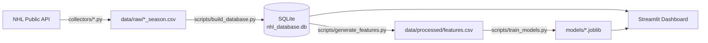

# Hockey AI Analytics Platform

An end-to-end NHL analytics pipeline: pulls real data from the NHL's public API, stores it
in a validated SQLite database, engineers leakage-safe predictive features, trains and
compares baseline ML models for game outcomes, and presents all of it through an
interactive Streamlit dashboard.

Built incrementally, phase by phase, with an emphasis on **honesty over polish** where the
two conflict — every scope limitation and every disappointing model result in this project
is documented in place rather than hidden, including in this README.

> Want to see it running? `streamlit run dashboard/Home.py` after setup below —
> screenshots aren't embedded here yet, but the app is a couple of commands away.

## What it does

- **Collects** real NHL standings, schedules, team stats, and player stats from the
  NHL's public (unofficial, keyless) API
- **Stores** everything in SQLite with real primary keys, foreign keys, and validation
  (row counts, null checks, duplicate checks, referential integrity)
- **Engineers features** for game prediction — rolling win%, scoring, and rest-day trends —
  with data leakage prevention as a first-class design constraint, not an afterthought
- **Trains and compares** Logistic Regression, Random Forest, and XGBoost against a
  majority-class baseline, using a time-aware (chronological) train/val/test split
- **Visualizes** standings, team form trends, player leaderboards, and game history in a
  multi-page Streamlit + Plotly dashboard

## Architecture



Each stage is a separate, independently-runnable script — the pipeline is meant to be
inspected and rerun stage by stage, not treated as one opaque process.

## Tech stack

| Layer | Tool |
|---|---|
| Data collection | `requests` + `pandas` |
| Storage | SQLite (raw `sqlite3`, no ORM) |
| Feature engineering | `pandas` (rolling/expanding windows) |
| ML | `scikit-learn`, `xgboost` |
| Dashboard | `streamlit` + `plotly` |
| Testing | `pytest` |

No LLM, no API keys, no cloud services, no paid dependencies anywhere in this stack —
everything here runs entirely locally for free.

## Project structure

```
collectors/          NHL API -> data/raw/<dataset>_<season>.csv (one script per data type)
src/api/              HTTP client + endpoint wrappers for the NHL API
src/database/         SQLite schema, import/upsert logic, queries, validation
src/features/         Leakage-safe rolling feature engineering
src/models/           Dataset prep, time-aware split, training, evaluation
scripts/              Runnable entrypoints that tie src/ modules together
dashboard/            Streamlit multi-page app
tests/                pytest suite
database/schema.sql   Table definitions (source of truth for the DB structure)
data/raw/             Collector output (gitignored, regenerate anytime)
data/processed/       Generated features (gitignored, regenerate anytime)
models/               Trained models (gitignored) + evaluation_report.json (tracked)
```

## Getting started

Requires Python 3.12+ (developed and tested on 3.12.6).

```
git clone <this-repo>
cd "Hockey AI Analytics Platform"
python -m venv venv
venv\Scripts\python.exe -m pip install -r requirements.txt
```

No `.env` file or API key is needed — the NHL's public API requires no authentication.

## Running the pipeline

Run these in order. Each is idempotent — rerunning any step is always safe.

```
# 1. Pull fresh data from the NHL API into data/raw/<dataset>_<season>.csv
#    (past seasons are fetched once and then skipped; delete a file to re-fetch it)
venv\Scripts\python.exe collectors\collect_teams.py
venv\Scripts\python.exe collectors\collect_players.py
venv\Scripts\python.exe collectors\collect_games.py

# 2. Build/update the SQLite database from those CSVs, with validation
venv\Scripts\python.exe scripts\build_database.py

# 3. Generate leakage-safe ML features from the database
venv\Scripts\python.exe scripts\generate_features.py

# 4. Train and compare models (saves to models/*.joblib)
venv\Scripts\python.exe scripts\train_models.py

# 5. Launch the dashboard
venv\Scripts\python.exe -m streamlit run dashboard\Home.py
```

The dashboard also has a "Refresh all data" button that reruns steps 1-3 for you.

## Testing

```
venv\Scripts\python.exe -m pytest tests\ -v
```

15 tests covering: database upsert idempotency and foreign key enforcement, the
leakage-safe rolling feature logic (including the offseason season-boundary edge case),
the time-aware split, and the prediction baseline's train/eval separation.

## Data source & honest limitations

Data comes from the NHL's public API (`api-web.nhle.com`) — free, no key required, but
**unofficial and undocumented**. Field names in this codebase were verified against live
responses (see `scripts/explore_api.py`), not assumed from documentation that doesn't
exist. If the NHL changes something, collectors are designed to fail loudly rather than
silently return bad data.

Known, deliberate scope limitations (not bugs):

- **Two seasons are collected:** the current one (`CURRENT_SEASON` in
  `src/utils/constants.py`) and last season (`HISTORICAL_SEASONS`), whose games double
  as model training history. A toggle in the top-right of every dashboard page switches
  all views between them; past seasons show final standings.
- **No starting-goalie data.** The NHL's box-score endpoints don't expose which goalie
  started a game without a separate boxscore/gamecenter collector this project doesn't
  build. Team-level rolling goals-against is used as an imperfect proxy.
- **No per-game player logs**, so "player points" (mentioned in the original project
  roadmap as a possible target) isn't buildable — `players` data is season totals only.
- **Model accuracy is modest: ~52-57% vs. a ~50-53% baseline** (always predicting the
  more common outcome). This is reported plainly in the dashboard, not smoothed over.
  Likely causes: no goalie/special-teams data, only ~900 training rows from one season,
  and hockey's genuinely high game-to-game variance compared to other sports.
- **No AI/LLM layer.** The original project concept included one; it was deliberately
  cut early on to avoid ongoing API costs and keep this fully free to run.

## Possible future work

- Collect additional seasons once available, for a true out-of-season test holdout
- A starting-goalie collector (via NHL boxscore/gamecenter endpoints) to unlock real
  goalie-specific features
- Per-game player logs, enabling an actual player-points model
- Advanced analytics: shot maps, an expected-goals (xG) model, player similarity
  clustering — all deferred since they need shot-coordinate data not yet collected
- A scheduled task (e.g. Windows Task Scheduler running `scripts/build_database.py`
  daily) to keep the database current automatically once a season is in progress

## About this project

A hockey analytics platform built end-to-end in Python: NHL API data collection, SQLite
storage with real validation, leakage-safe ML feature engineering, baseline model
comparison (Logistic Regression / Random Forest / XGBoost) with time-aware evaluation,
and an interactive Streamlit dashboard — built incrementally with tests at every stage
and honest reporting of what does and doesn't work well.
